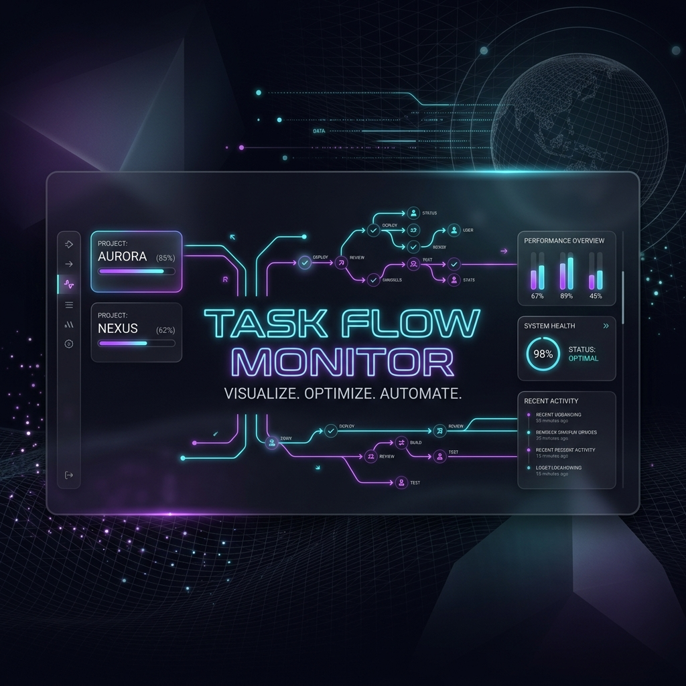

<p align="center">
  
</p>

<p align="center">
  <a href="https://github.com/afnan-altaf/task-tracker-mcp/blob/main/LICENSE">
    
  </a>
  
  
  
  <a href="https://github.com/afnan-altaf/task-tracker-mcp/actions">
    
  </a>
  
</p>

<h1 align="center">JamberTech Task Flow MCP Server</h1>

<p align="center">
  A premium, high-performance, and custom <strong>Model Context Protocol (MCP) Server</strong> that automatically spins up a gorgeous, real-time task visualization dashboard on <a href="http://localhost:9886">http://localhost:9886</a>. Built to be 100% zero-dependency for enterprise-grade execution stability.
</p>

---

## 🎨 Premium Visual Aesthetics

The web application's dashboard is meticulously hand-crafted following state-of-the-art Web Application Development guidance:
* **Glassmorphic UI**: Translucent visual panels leveraging high-density blur coefficients (`backdrop-filter: blur(20px)`) and fine reflective border accents.
* **Ambient Backdrop Glows**: Sleek HSL-tailored neon gradients mapping a premium dark color spectrum (Neon Purple to Cosmic Turquoise).
* **Fluid Micro-Animations**: Smooth keyframe transitions, pulsing online indicators, and glowing progress indicators which make the dashboard feel alive and interactive.

---

## 📂 Project Repository Directory Tree

A professional layout detailing all key enterprise and community assets:

```text
task-tracker-mcp/
├── .github/
│   ├── ISSUE_TEMPLATE/
│   │   ├── bug_report.md
│   │   └── feature_request.md
│   ├── PULL_REQUEST_TEMPLATE.md
│   └── workflows/
│       └── node.js.yml         # GitHub Actions CI/CD Pipeline
├── public/
│   ├── assets/
│   │   └── banner.png          # High-end Repository Header Banner
│   ├── app.js                  # SSE Real-time client script
│   ├── index.html              # Dashboard markup
│   └── style.css               # Elegant CSS Stylesheet
├── .eslintrc.json              # Linting rules
├── .gitignore                  # Ignoring runtime database logs & dependencies
├── .prettierrc                 # Code formatting rules
├── CODE_OF_CONDUCT.md          # Welcoming community standards
├── CONTRIBUTING.md             # Standard developer setup instructions
├── LICENSE                     # Apache-2.0 License Terms
├── README.md                   # Visual Project Documentation
├── index.js                    # Pure Node.js high-performance server core
├── package.json                # Project details & npm hooks
└── test.js                     # Standard verification test suite
```

---

## 🛠️ MCP Tool Definitions

The server exposes highly descriptive schemas for AI agents (Antigravity & Claude) to record development progression:

| Tool Name | Description | Arguments |
| :--- | :--- | :--- |
| **`start_task`** | Launches tracking for a main parent workflow task. | `name` (string, req), `description` (string), `estimated_minutes` (number) |
| **`add_subtask`** | Appends a specific job/work item under an active parent task. | `task_name` (string, req), `subtask_name` (string, req), `estimated_minutes` (number) |
| **`update_progress`** | Real-time update for a subtask's progress, state, and status logs. | `task_name` (string, req), `subtask_name` (string, req), `progress_percent` (number, req), `status` (pending/running/completed/failed), `status_message` (string) |
| **`complete_task`** | Finishes the parent task and completes all associated subtask items. | `task_name` (string, req) |
| **`clear_tasks`** | Wipes task telemetry and resets the workspace board. | *(None)* |

---

## 🏗️ Architecture & SSE (Server-Sent Events)

* **Zero-Dependency Engine**: Handcrafted with native Node.js core modules (`http`, `fs`, `readline`, `path`) ensuring absolutely instant startup times, maximum network speed, and zero npm install package bloat.
* **Real-time Synchronization**: Uses lightweight, persistent Server-Sent Events (SSE) connections (`new EventSource('/events')`) between the backend and browser front-ends.
* **Progress-Velocity Time Estimator**: Computes smart estimated remaining task execution time (ETA) dynamically using:
  $$\text{Remaining Seconds} = \text{Elapsed Seconds} \times \frac{100 - P}{P}$$
  (falling back to your original time estimate adjusted for elapsed time if $P = 0$).

---

## 🚀 Setup & Integration

### 1. For Antigravity IDE
Add the server entry to your custom IDE settings `mcp_config.json`:
```json
{
  "mcpServers": {
    "task-tracker": {
      "command": "node",
      "args": [
        "C:\\Users\\Mianjee\\.gemini\\antigravity-ide\\scratch\\task-tracker-mcp\\index.js"
      ]
    }
  }
}
```

### 2. For Claude Desktop / Claude Code
To use this custom server with the official Claude Desktop client or Claude Code CLI on Windows, append the configuration inside the global Claude config file located at:
`%APPDATA%\Claude\claude_desktop_config.json`
*(e.g., `C:\Users\Mianjee\AppData\Roaming\Claude\claude_desktop_config.json`)*:

```json
{
  "mcpServers": {
    "task-tracker": {
      "command": "node",
      "args": [
        "C:\\Users\\Mianjee\\.gemini\\antigravity-ide\\scratch\\task-tracker-mcp\\index.js"
      ]
    }
  }
}
```
*Note: Claude Code CLI automatically inherits custom MCP tool setups directly from your Claude Desktop settings config on startup!*

### 3. Standalone Manual Start
You can boot up the dashboard server manually by executing:
```bash
node index.js
```
Then open [http://localhost:9886](http://localhost:9886) in your browser.

---

## 📄 Apache-2.0 License

This project is licensed under the Apache License, Version 2.0. Copyright 2026 JamberTech Official.

Original rights, patent protections, and trademarks remain strictly with JamberTech Official. You are free to redistribute, use, and modify under the conditions defined in the [LICENSE](LICENSE) file.
